# 🚀 Interactive Tech Portfolio & 3D Models

Welcome to my portfolio of interactive prototypes, 3D environments, and AI architecture. This repository showcases the comprehensive development work I've completed across the **Quantum Hackathon**, my **Orion Internship**, and my **Infosys Internship**. 

---

## 👕 Dripcheck AR Prototype
**Role/Tech:** Interactive AR Prototype & UI Design
A visual showcase and video demonstration of the Dripcheck project prototype. 

**AR Prototype Interface:**
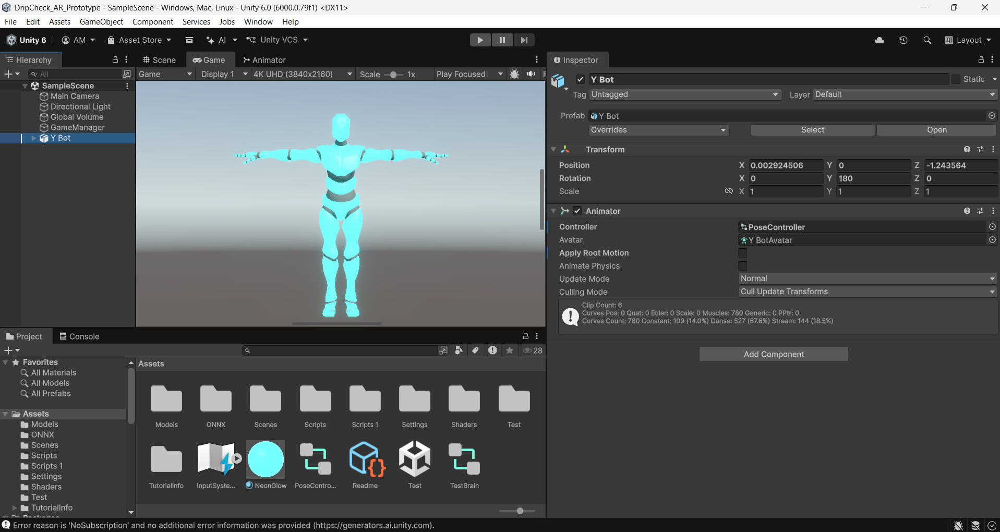

**Watch the Video Demo:**

---

## 🎮 Interactive AI Gaming Kiosk
**Role/Tech:** 3D Modeling, UI/UX Design, Kiosk Architecture
The structural and visual design for a standalone interactive gaming kiosk used for real-time AI tracking.

**Final Kiosk Render:**
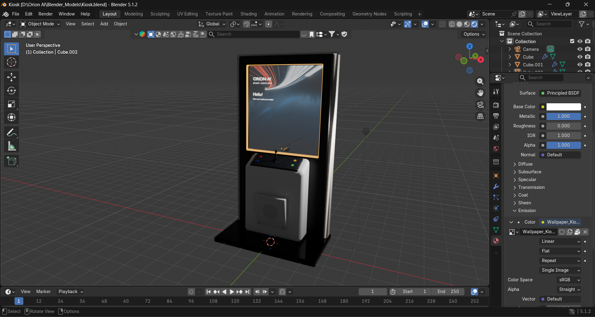

**Under the Hood (Wireframe):**
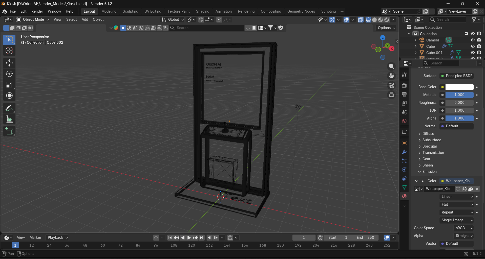

---

## 🎨 3D Environments & Modeling (Blender)

### The Virtual Restaurant
A fully modeled, textured, and lit 3D restaurant environment. 

**Watch the Teaser Video:**

**Environment Overview & Renders:**
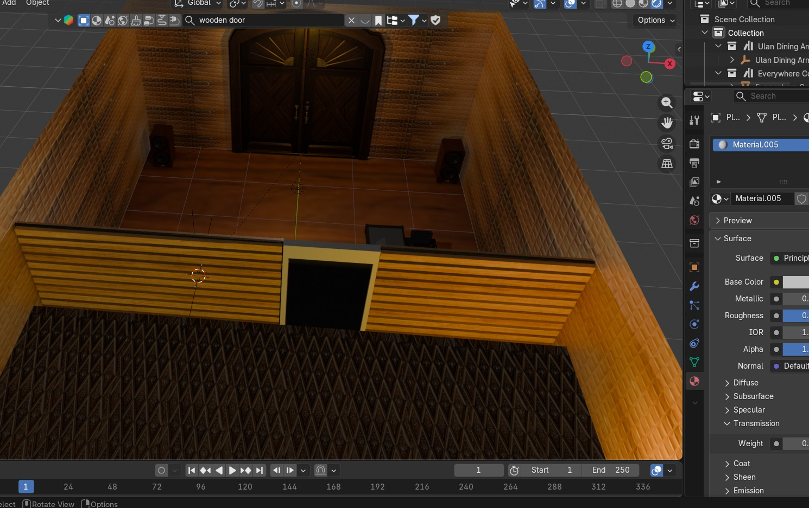
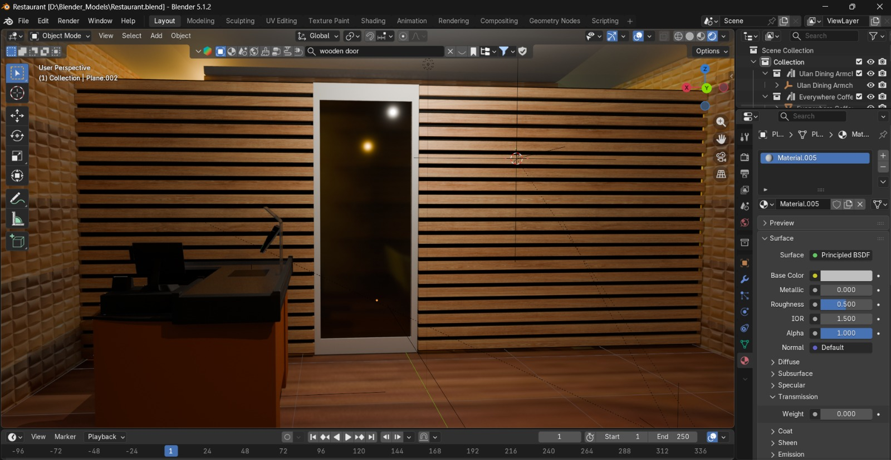
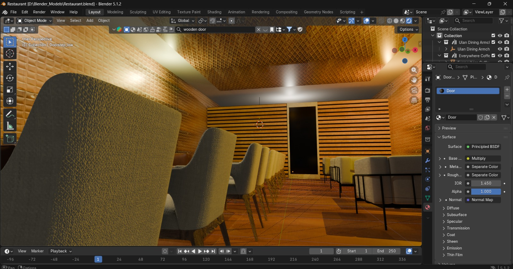
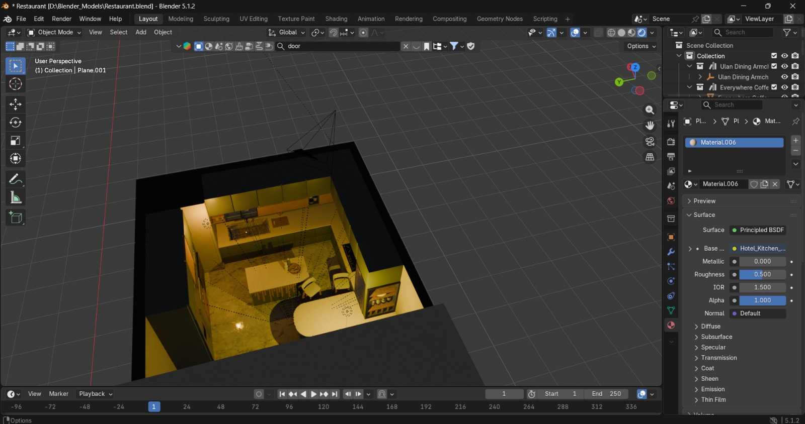
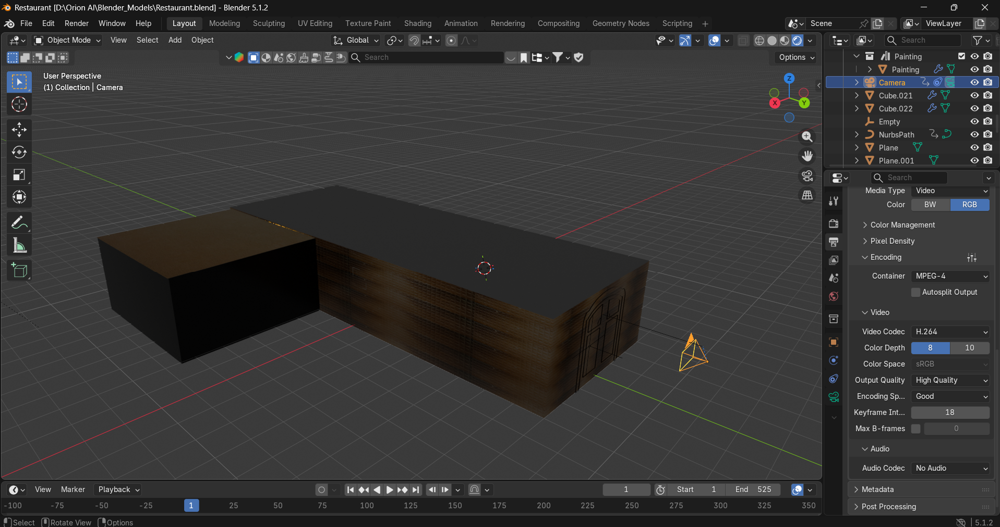

**Mesh & Wireframe:**
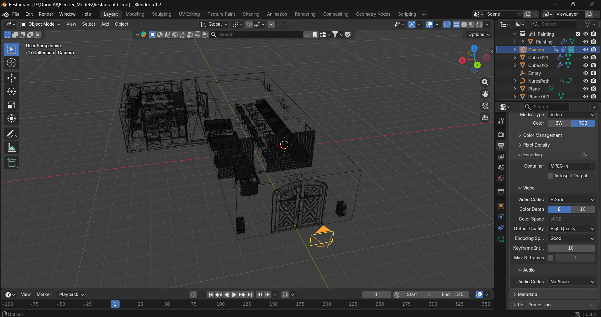

---

### Dosa 3D Model
Detailed texturing and mesh modeling for interactive in-game assets.

**Final Dosa Render:**
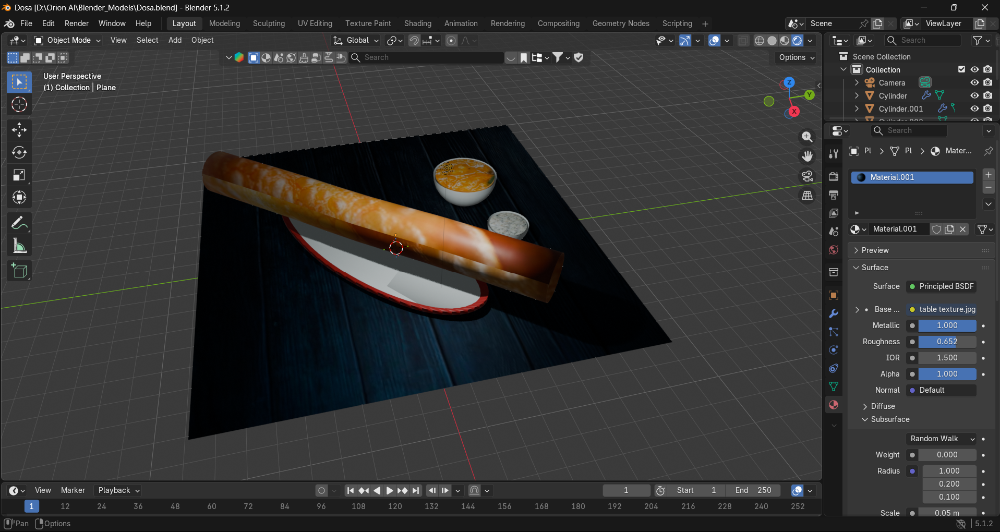

**Mesh & Wireframe:**
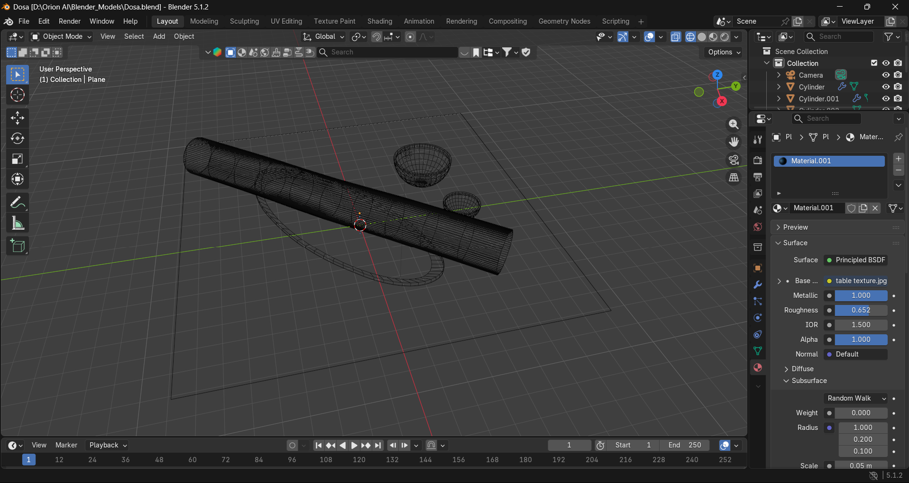
